# Introduction

This project is a prototype for the purpose demonstrairing how to use [Keycloak](https://www.keycloak.org/) as an IAM (Identity and Access Management) provider.

## System Prerequisites

- [Docker](https://www.docker.com/)
- [docker-compose](https://github.com/docker/compose)

## Setting up the project

The process for installing and getting up and running the project is fully automated by the `./manage` script and the varios commands it provides.

### Before you start

You have to create a .env file from the .env.exaple file that is inside `./projects/system-startup`.

You have to modify your `/etc/hosts` file and append the following:

```bash
127.0.0.1 prototype.loc
127.0.0.1 konga.prototype.loc
127.0.0.1 accounts.prototype.loc
```

<span style="color:red">
  NOTE: If you are using mac you maybe need to replace `127.0.0.1` with the docker virtual machine IP address.
</span>

### Installing

`./manage install`

This command will:

- Download images, if not present.
- Build images from Dockerfiles, if needed.
- Run containers.
- Run database migrations and setup scripts.
- Get the system up and running.

<span style="color:red">
  NOTE: This command must only be used the first time you run the system, or after executing `./manage uninstall`.
</span>

After the scripts are done executing you can access the application through your browser:

- [https://prototype.loc:8443](https://prototype.loc:8443): Dummy react application created with react-create-app.
- [https://konga.prototype.loc:8443](https://konga.prototype.loc:8443): Kong dashboard.
- [https://accounts.prototype.loc:8443](https://accounts.prototype.loc:8443): Keycloak dashboard.

### Running

`./manage init`

This command will init the system after it have been halted.

### Configuring keycloak and kong

`./manage bootstrap`

This command will:

- Set up the the realm in Keycloak.
- Register services in kong.

### Stopping

`./manage halt`

This command will shutdown the system.

### Uninstalling

`./manage uninstall`

This command will:

- Stop containers.
- Remove containers.
- Remove volumes.
- Remove networks.
- Remove built images.

### Executing docker-compose commands

Any docker-docker compose command can be executed by following this syntax `./manage [docker-compose comand]`, e.g.:

```bash
./manage logs -f kong
./manage exec kong bash
./manage restart keycloak
```

## Setting up Azure AD

### Requirements
- The system must be up and running.
- An Azure account with access to Azure AD.

### Setup

#### Creating Active Directory

IF YOU HAVE AN ACTIVE DIRECTORY ALREADY YOU CAN SKIP THIS SECTION.

1. Browse to the [Azure portal](https://portal.azure.com/).

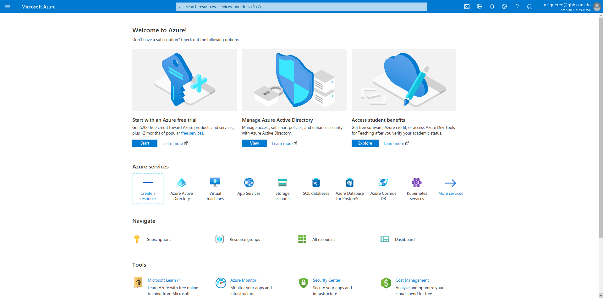

2. Select the **plus icon** (+) and search for **Azure Active Directory**.

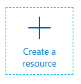

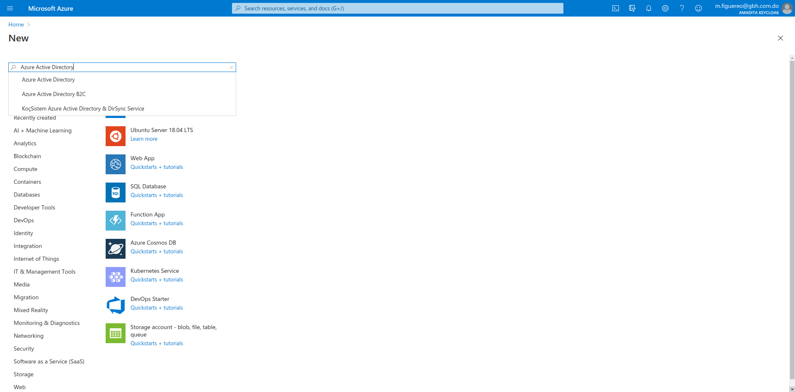

3. Select **Create**.

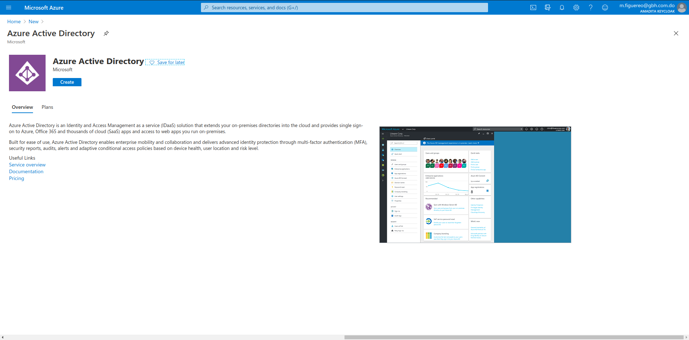

4. Provide an **Organization name** and an **Initial domain name**. Then select **Create**.

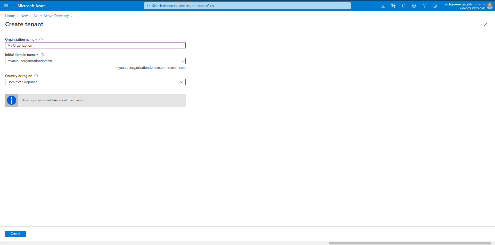

#### Setting Keycloak

1. Ragister a new application using Azure portal; follow the instructions in this [link](https://docs.microsoft.com/en-us/azure/active-directory/develop/quickstart-register-app).

2. Let's import the configuration. Copy the OpenID connect metadata url.

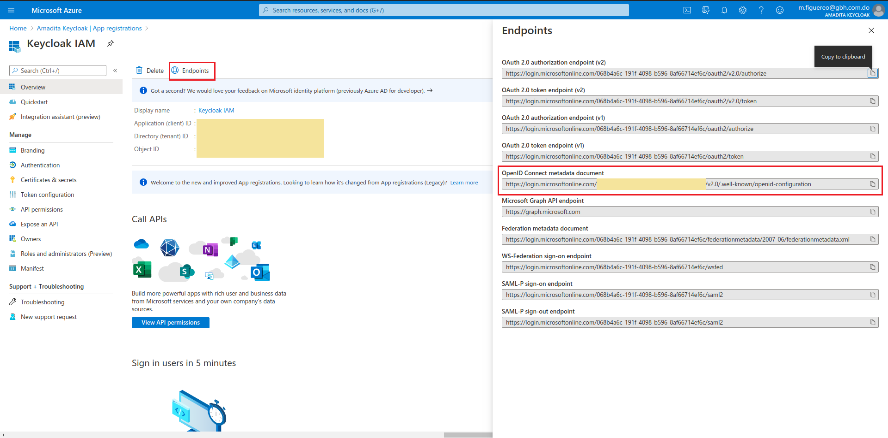

3. Go to the [Keycloak dashboard](https://accounts.prototype.loc:8443/) and login.

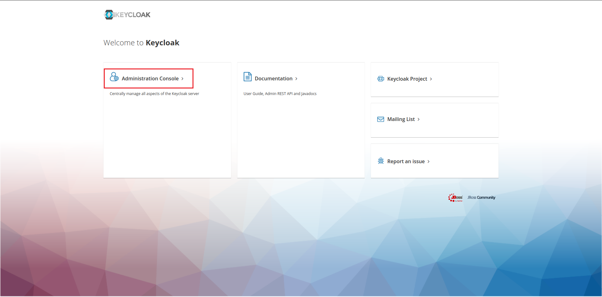

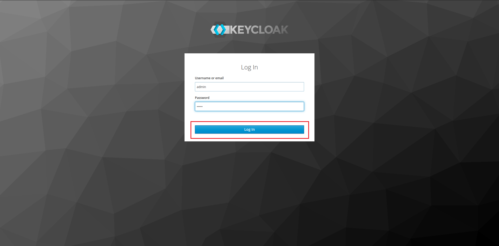

4. Go to the **Identity Providers** page.

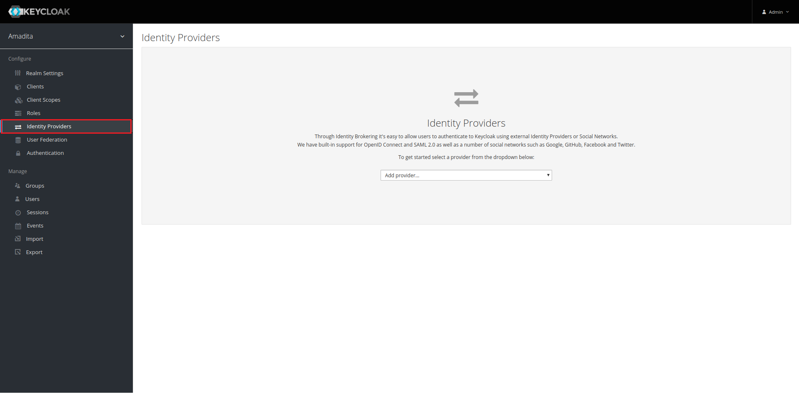

5. Add a new **OpenID Connect** provider.

6. Scroll to the button of the screen and paste the url you copied from Azure (step 6) in the **Import from URL** field. Then click **Import**. Most of the form will be filled automatically.


7. Now scroll up to the **Client Authentication** section. Set client authentication as in the image. You can get **Client ID** and **Client Secret** from Azure.


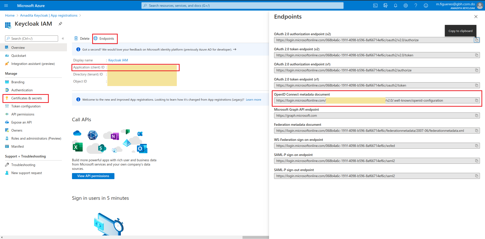
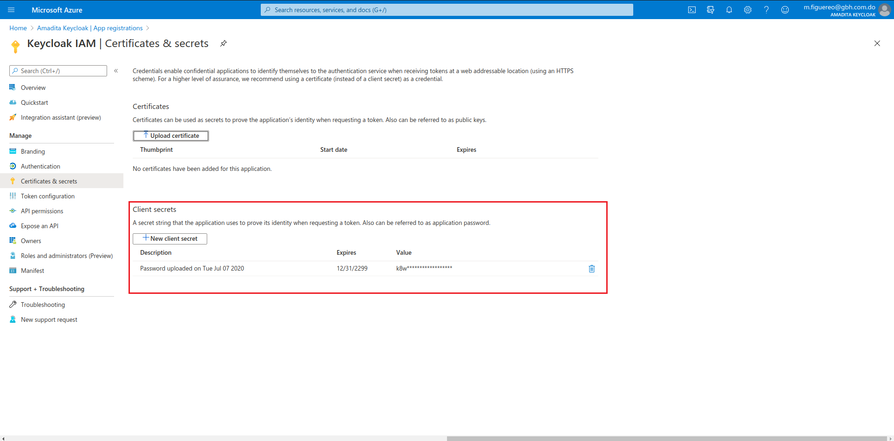

8. Scroll up and set **Display Name** to **Azure AD**.

9. Click **Save**.

10. Go to the **Authentication** page. Select **Broser** flow and make sure everything looks like in the screenshot below.

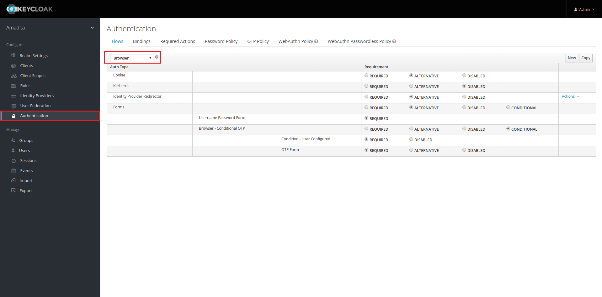

That's it, now you should be able to login with your Azure Active directory.

